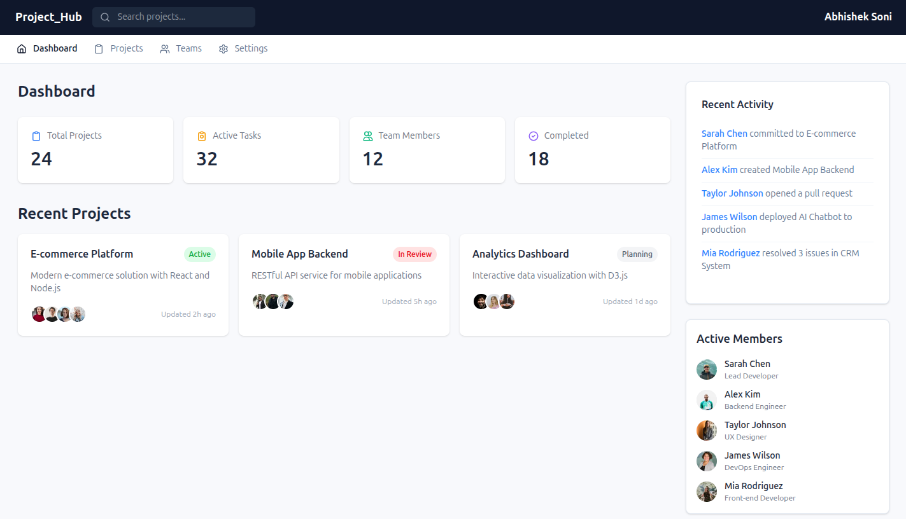
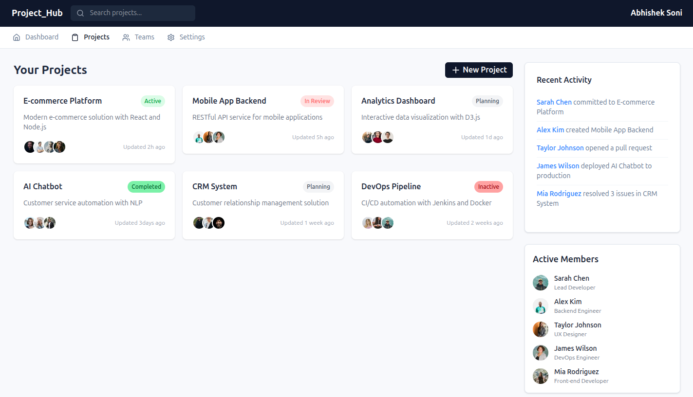
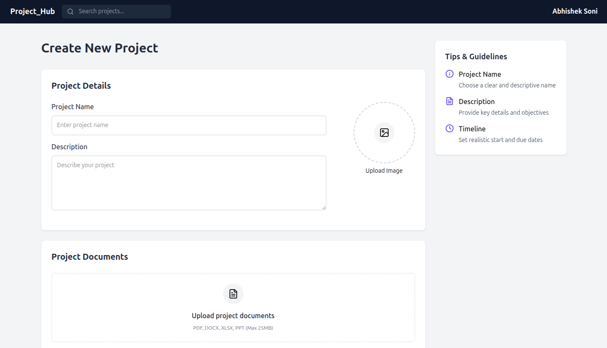
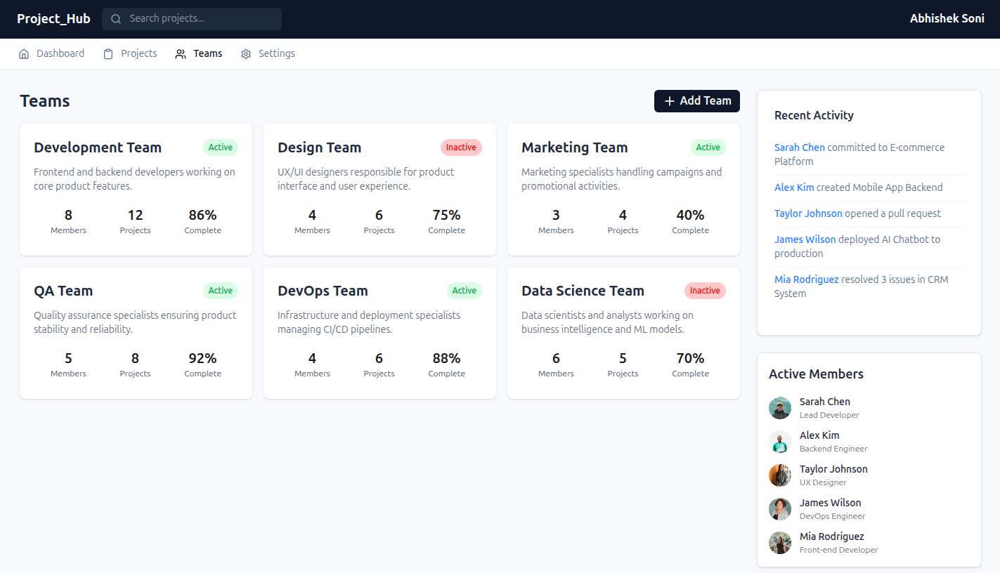

# 🚀 Project_Hub

**Project_Hub** is a collaborative platform designed for individuals and teams to **connect**, **manage**, and **track their projects** seamlessly. Whether you're working on academic research, a startup idea, or a personal tech build, Project_Hub helps you organize everything in one place and share updates with collaborators.

---

## 🌟 Features

- 🧑‍🤝‍🧑 Connect with like-minded individuals or form teams
- 📌 Create and manage multiple projects
- 📝 Share project updates and progress in real-time
- 🗂️ Store key project data and documentation
- 🔍 Browse or search existing projects

---

## 🎯 Purpose

Project_Hub was built to empower students, developers, and creators by giving them a centralized space to:

- Collaborate efficiently
- Keep project information organized
- Encourage peer-to-peer learning and contribution
- Document progress for future reference or portfolios

---
## 📸 Screenshots

### 🏠 Dashboard

### 📂 Projects

### 🆕 New Project

### 👥 Teams
